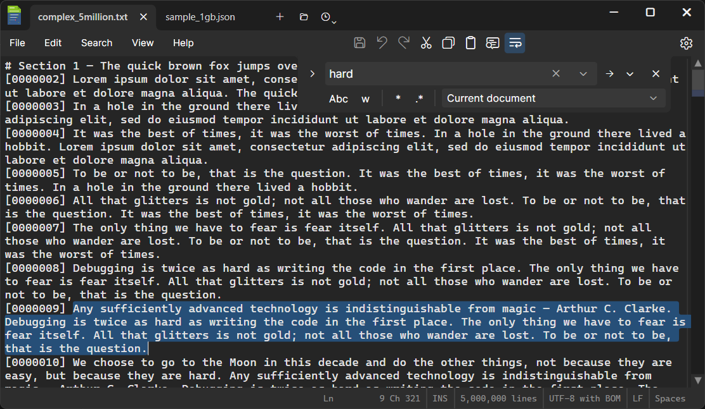
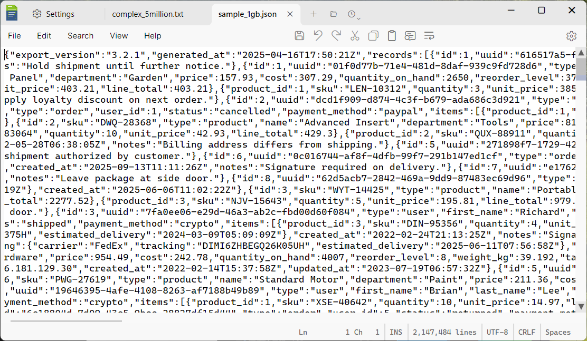
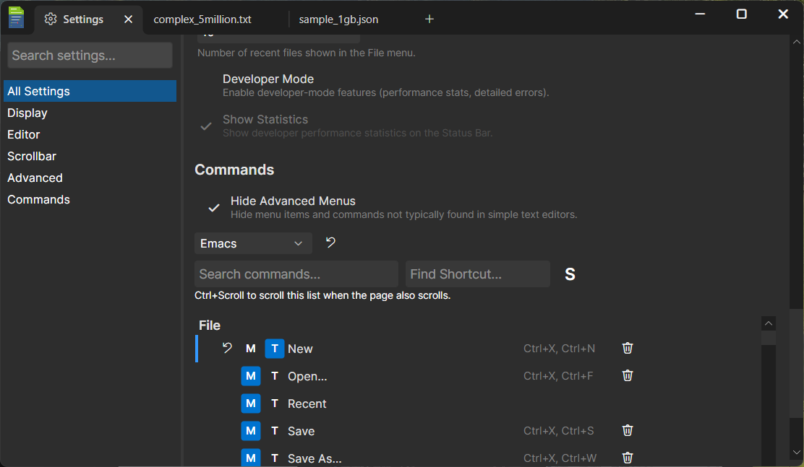
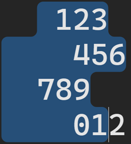
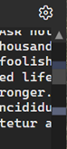
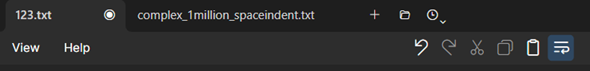
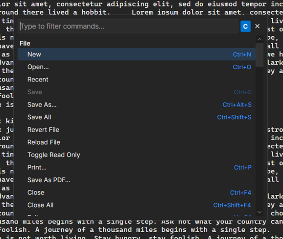

# DMEdit

A lightweight, fast, cross-platform text editor built from scratch with .NET and [Avalonia UI](https://avaloniaui.net/).



## Why another text editor?

The world doesn't need another text editor. We built one anyway.

DMEdit started as a recurring itch — the kind of side project that gets
attempted every few years, gets bogged down in line wrapping algorithms or caret
rendering, and quietly shelved. The original frustration was simple: existing
editors either choked on large files or came with enough menus to qualify as
flight simulators. There had to be a sweet spot between beauty, simplicity, and
power.

What changed this time was AI. Building a text editor from scratch means
reinventing a *lot* of wheels — piece tables, line trees, text layout engines,
custom scrollbars, session persistence — and doing it all with nothing but a
single desktop GUI library. Claude made it possible to actually build a very polished application in just a few weeks.

The result is an editor that opens a 1 GB JSON file without flinching, has the
muscle memory of your favorite IDE (or will, once you pick a key binding
profile), and doesn't require a PhD to configure.

## Features

**Performance first.** DMEdit was designed around large files from day one.
A paged buffer architecture streams content from disk on demand — you can open
multi-gigabyte files and scroll through them instantly. No foreverloading spinners, no
"file too large" dialogs, and no features such as word wrapping disabled when the file is too large. (*Large single-line files such as the one below do force loading with implicit line-feeds for display only*)



**Built from scratch.** Every pixel is ours. The editor control, tab bar,
scrollbar, find bar, settings panel, and even the text input boxes are
custom-drawn controls. This isn't a wrapper around a web view or an embedded
Scintilla — it's a native .NET application that renders text the same way on
Windows and Linux.

**Keyboard-driven.** Six built-in key binding profiles (Default, VS Code,
Visual Studio, JetBrains, Eclipse, Emacs) with full customization. Two-key
chord bindings, a command palette, and 100+ commands covering everything from
line manipulation to clipboard ring cycling.



**Configurable.** Three toolbar zones, customizable menus, and a
settings panel with just the right amount of flexibility.
Don't use Save As? Hide it. Want Clipboard Ring on the toolbar? Toggle it on.

**The little things.** Session persistence that remembers your open tabs
and unsaved edits across restarts, including undo/redo. File change detection when external tools modify your files, with tail support for log files. Settings 
to customize behavior balancing complexity with approachability.

### A closer look

**Rounded selection corners.** Multi-line selections trace a smooth contour
with rounded corners at every step — both the outer convex corners and the
inner concave notches where line widths change. A small detail, but once you
see it you can't go back to jagged rectangles.



**Dual-zone scrollbar.** The inner thumb works like a normal scrollbar. The
outer zone provides a fixed-rate scroll — click and hold above or below the
thumb to scan through the document at a steady pace, regardless of file size.
Useful for skimming million-line files where a single pixel of thumb movement
would jump thousands of lines.



**Three toolbar zones.** The tab toolbar (right of tabs) holds document-level
commands like New, Open, and Recent. The center toolbar holds editing commands.
The settings gear stays put on the right. Every button is individually
toggleable from Settings > Commands.



**Command palette and full command system.** Over 100 commands, all searchable
from the command palette. Every command can be bound to one or two key
gestures, shown or hidden in menus and toolbars, and discovered through
the palette. Six built-in profiles let you keep the muscle memory from
your editor of choice.



**Smart Indent.** Borrowed from Emacs, Smart Indent
re-indents the current line based on context — no fiddling with spaces and
tabs. Regular indent and outdent commands are there too, along with the
ability to insert a literal tab character when you need one.


## Architecture

DMEdit is split into layers:

- **DMEdit.Core** — Document model, piece table, paged file buffers, line index
  tree, I/O. No UI dependencies.
- **DMEdit.Rendering** — Text layout engine wrapping Avalonia's TextLayout API.
- **DMEdit.App** — The desktop application: EditorControl, tab bar, scrollbar,
  find bar, settings, toolbar, and all the chrome.
- **DMEdit.Windows** — We resorted to Windows OS calls for two features, printing, and clipboard. Avalonia and dotnet do have portable clipboard support, but we wanted more control than they provide, and this
  allows us to support copy/paste of gigabyte text files into the middle of other gigabye text files and
  other such insanity. 

The core data structure is a **piece table** backed by a paged file buffer
(for the original file content) and a chunked UTF-8 buffer (for insertions).
Large files are memory-mapped in pages and accessed on demand — the editor
never loads the entire file into memory.

## Building

```
dotnet build
dotnet test
```

Requires .NET 10. All 599 tests should pass.

## What's next

DMEdit is a text editor today, and we intend to keep it that way — but a
well-rounded one. The near-term roadmap includes:

- **Markdown editing support** — not just syntax highlighting, but rethinking
  how a markdown editor could work differently. Since starting this project we can 
  see that Microsoft Notepad is thinking along similar lines. How clever of them to
  preemptively copy the gist of our plan before we even implement it. 
- **Format-aware modes** for JSON, XML, HTML — structural awareness without
  becoming a full IDE.
- **Syntax highlighting** for common languages, but without introduction of too many 
features that belong in an IDE.

## What's not next
- **Plugins** — We really don't want to open Pandora's box by supporting full customization
through a plug-in feature. We want to keep things simple, and nothing leads to complexity
as quickly as letting people implement a pac-man tab in your text editor.

There's a separate, longer-term idea for a dedicated code editor/IDE targeting
a single language (likely C#), but that's a different product. DMEdit stays
in the "powerful text editor" lane — the tool you reach for when you need to
open a log file, edit a config, or wrangle a data dump.

## The AI story

DMEdit was built almost entirely through pair programming with Claude Code. 
The [design journal](docs/design-journal.md) documents every
architectural decision, from the initial piece table design through custom
scrollbar rendering and UTF-8 buffer optimization.

This isn't a novelty — it's a proof of concept for a different way of building
software. A solo developer with AI assistance built a native cross-platform
desktop application with custom rendering, 100+ commands, session persistence,
and large file support in about five weeks. The codebase has 599 tests and
handles edge cases that would take months to discover through manual testing
alone.

All bugs are human hallucination.
